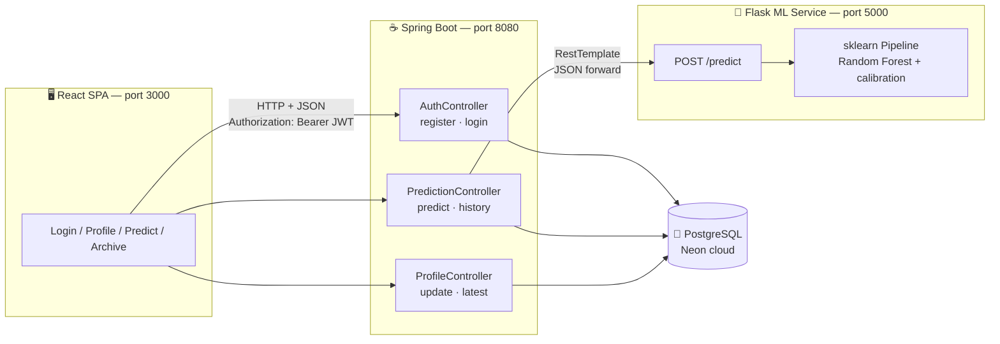
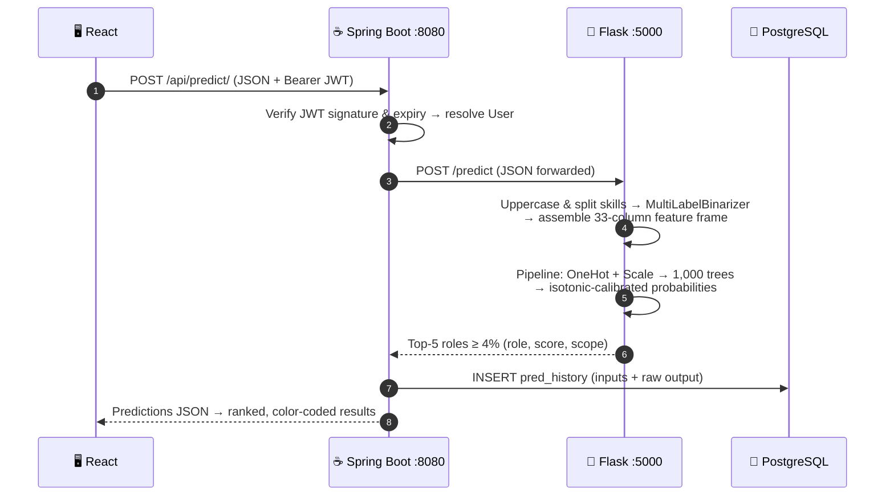
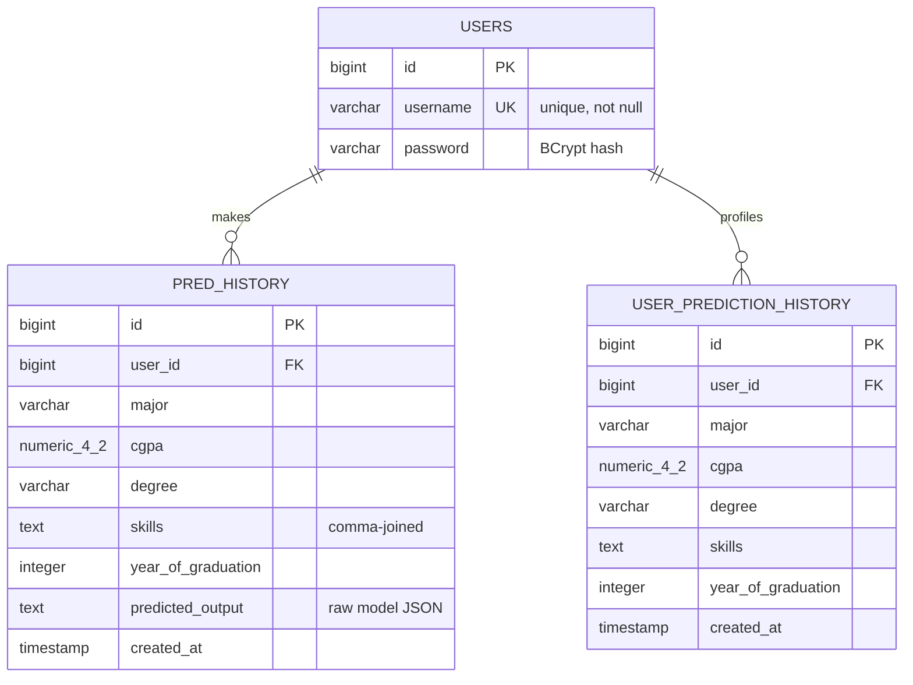

<div align="center">

# 🎓 EDU2JOB

### AI-Powered Career Recommendation Platform

*Predict your ideal job role from your education, CGPA and skills — powered by a calibrated Random Forest model.*


</div>

---

## 📽️ Demo

https://github.com/user-attachments/assets/b62605c9-e3de-4630-8412-d9ed3c461f32

---

## 📖 About

**EDU2JOB** answers one question every student faces: *"What job role actually fits me?"*

Instead of generic advice, EDU2JOB uses a **machine-learning classifier trained on historical student-to-role data**. You enter your **degree**, **major**, **CGPA** and **technical skills** — the model returns your **top 5 job roles, ranked by calibrated probability**, each with a short career-scope description.

Built end-to-end during the **Infosys SpringBoard Internship 6.0** (Aug 2025 – Oct 2025).

### The problem it solves

- Students choose career paths late, blindly, or by peer pressure
- Generic advice ignores *measurable* signals: what you studied, how well you performed, what you can actually do
- EDU2JOB compresses career confusion into a **ranked, confidence-scored shortlist** in one click

---

## ✨ Features

| | Feature | Details |
|---|---|---|
| 🧠 | **ML Job-Role Prediction** | Top-5 roles ranked by probability, with a 4% confidence floor |
| 🎯 | **Calibrated Confidence** | Isotonic probability calibration — scores track observed frequencies, not raw vote shares |
| 🔐 | **Secure Authentication** | JWT (HS256) sessions with BCrypt-hashed passwords |
| 👤 | **Profile Management** | Persisted profile with partial-update support |
| 🕓 | **Prediction History** | Every prediction archived with inputs + raw model output |
| 📊 | **Analytics Dashboard** | KPI cards, top-roles bar chart, skill-distribution doughnut (Chart.js) |
| 🏗️ | **Three-Tier Architecture** | React SPA → Spring Boot API → Flask ML service → PostgreSQL |

---

## 🏗️ Architecture



**Design principles**

- **Single entry point** — React talks only to Spring Boot; the browser never reaches Flask or the database directly.
- **Python for ML, Java for business logic** — the model is a native scikit-learn artifact served by Flask; no cross-language model translation.
- **Stateless ML service** — all state lives in PostgreSQL behind the Spring Boot boundary; Flask replicas can scale horizontally.
- **Auditable predictions** — Spring stores each prediction's inputs *and* the raw model response, so history stays replayable across model versions.

### One prediction, end to end



---

## 🤖 The Machine Learning Model

### How it works

| Stage | Component | Details |
|---|---|---|
| **Inputs** | `degree` | Categorical → `OneHotEncoder` (B.Sc, B.Tech, M.Sc, M.Tech, MBA) |
| | `major` | Categorical → `OneHotEncoder` (Business, Civil, CS, Electronics, Finance, Mechanical) |
| | `cgpa` | Numeric → `StandardScaler` (train-frozen μ/σ) |
| | `skills` | Multi-valued → `MultiLabelBinarizer` (30-token vocabulary: `PYTHON`, `SQL`, `DATA STRUCTURES`, `THERMODYNAMICS`, …) |
| **Model** | `RandomForestClassifier` | 200 trees · Gini impurity · `max_features=sqrt` · bootstrap · `class_weight=balanced` · `random_state=42` |
| **Calibration** | `CalibratedClassifierCV` | Isotonic regression, 5-fold ensemble → **1,000 trees total** serving calibrated probabilities |
| **Output** | 7 job roles | Data Scientist · Embedded Systems Engineer · Financial Analyst · Investment Banker · Manufacturing Engineer · Mechanical Engineer · Software Engineer |
| **Ranking** | `predict_proba` → sort | Descending by probability, top-5, filtered at a **0.04 confidence floor**, formatted as percentages |

> **Why calibration?** Fully grown trees produce near one-hot vote shares, so raw Random Forest probabilities cluster at 0/100. The isotonic layer maps scores to empirically observed frequencies — the confidence percentages shown to users actually mean something.

### Trained artifacts (included in the repo — no training needed to run)

| File | Size | Contents |
|---|---|---|
| `edu2job-flask-ai/ml_models/job_role_model.pkl` | 51.4 MB | Full fitted `Pipeline` (preprocessor + calibrated forest) |
| `edu2job-flask-ai/ml_models/label_encoder.pkl` | <1 KB | Class-index → role-name decoder |
| `edu2job-flask-ai/ml_models/mlb_encoder.pkl` | <1 KB | Skill vocabulary + multi-label binarizer |

⚠️ The artifacts were serialized with **scikit-learn 1.6.1** — pin that exact version when installing.

---

## 🔌 API Reference

### Spring Boot (`http://localhost:8080`)

| Method | Endpoint | Auth | Description |
|---|---|---|---|
| `POST` | `/api/auth/register` | — | Create account → returns JWT |
| `POST` | `/api/auth/login` | — | Authenticate → returns JWT |
| `POST` | `/api/profile/update` | JWT | Create/update profile (partial updates supported) |
| `GET` | `/api/profile/latest` | JWT | Fetch latest profile |
| `POST` | `/api/predict/` | JWT | Run prediction → top-5 ranked roles (also archived) |
| `GET` | `/api/predict/history` | JWT | Fetch this user's prediction history |

**Example — prediction**

```bash
curl -X POST http://localhost:8080/api/predict/ \
  -H "Authorization: Bearer <your-jwt>" \
  -H "Content-Type: application/json" \
  -d '{
    "degree": "B.Tech",
    "major": "Computer Science",
    "cgpa": 8.5,
    "skills": "Python,SQL,Java,Data Structures,Algorithms,Git",
    "yop": 2026
  }'
```

```json
{
  "predictions": [
    { "role": "Software Engineer", "score": "100.0", "scope": "Software Engineers design, develop, and maintain software systems…" },
    { "role": "Data Scientist", "score": "…", "scope": "…" }
  ]
}
```

### Flask ML service (`http://localhost:5000`, internal)

| Method | Endpoint | Description |
|---|---|---|
| `POST` | `/predict` | `{degree, major, cgpa, skills}` → ranked predictions JSON |

---

## 🗄️ Database Schema



- `pred_history` — one row per prediction: inputs + the **raw model response** (full audit trail)
- `user_prediction_history` — powers the profile feature (latest row per user)
- Schema is bootstrapped by Hibernate (`ddl-auto=update`) from the JPA entities

---

## 🚀 Getting Started

### Prerequisites

| Tool | Version |
|---|---|
| JDK | 21+ |
| Maven | 3.8+ |
| Python | 3.11+ |
| Node.js | 14+ (CRA) |
| PostgreSQL | local instance or cloud (e.g., [Neon](https://neon.tech)) |

### 1️⃣ Database

Create a database (local Postgres or a free Neon/Supabase instance) and note the connection details. Tables are created automatically by Hibernate on first boot.

### 2️⃣ Spring Boot backend (port 8080)

```bash
cd EDU2JOB
# edit src/main/resources/application.properties:
#   spring.datasource.url=jdbc:postgresql://<host>:5432/<db>
#   spring.datasource.username=<user>
#   spring.datasource.password=<password>
mvn spring-boot:run
```

> ⚠️ Use the `jdbc:postgresql://` scheme for the URL. For anything beyond local development, inject credentials via environment variables instead of committing them.

### 3️⃣ Flask ML service (port 5000)

```bash
cd edu2job-flask-ai
python -m venv venv
source venv/bin/activate        # Windows: venv\Scripts\activate
pip install flask pandas numpy joblib scikit-learn==1.6.1
python app.py
```

The pickled model loads at startup — first boot takes a few seconds while the 51 MB pipeline deserializes.

### 4️⃣ React frontend (port 3000)

```bash
cd edu2job-react-frontend
npm install
npm start
```

Open **http://localhost:3000**, register an account, complete your profile, and get your first prediction. 🎉

---

## 🔐 Security Notes

- **Passwords** — BCrypt (cost factor 10, per-password salt); never stored or logged in plain text
- **Tokens** — JWT (HS256), subject-bound, 10-hour expiry, verified on every protected request
- **CORS** — restricted to the React dev origin (`http://localhost:3000`)
- **CSRF** — disabled by design: stateless `Authorization`-header tokens present no CSRF surface
- **Before deploying** — externalize secrets (DB credentials, JWT signing key) to environment variables / a secret manager, and rotate any credentials that have touched version control

---

## 🧭 Roadmap & Known Limitations

Honest engineering — here's what's real today and where the project goes next:

- [ ] **JWT security filter** — token verification currently lives in the controllers; move to a `OncePerRequestFilter` + `SecurityContext` for uniform 401s and declarative authorization
- [ ] **Role-based access control** — single user type today; add role claims + `hasAuthority` rules
- [ ] **Resilient Spring→Flask call** — add connect/read timeouts, retry with backoff, and a circuit breaker
- [ ] **Externalized service URLs** — replace the hardcoded `localhost:5000` Flask URL with configuration
- [ ] **Skill vocabulary feedback** — unknown skills are silently ignored by the encoder; surface them in the UI and align the input whitelist with the model vocabulary
- [ ] **Versioned DB migrations** — replace `ddl-auto=update` with Flyway + `validate`
- [ ] **Model evaluation harness** — stratified k-fold, top-k accuracy, Brier score; retraining pipeline with drift monitoring
- [ ] **Production WSGI server** — gunicorn (with `--preload` to share the model across workers) instead of the Flask dev server
- [ ] **Docker alignment** — align the Dockerfile base image with the project's Java version

---

## 🛠️ Tech Stack

| Layer | Technologies |
|---|---|
| **Frontend** | React 18, React Router 6, Axios, Tagify (skill input), Chart.js, CSS3 |
| **Backend** | Java 21, Spring Boot 3.2.4 (Web, Data JPA, Security, Actuator), JJWT 0.11.5 |
| **Machine Learning** | Python 3.11, scikit-learn 1.6.1, Pandas, NumPy, joblib, Flask |
| **Database** | PostgreSQL (Neon cloud), Hibernate 6 |
| **Build & Tools** | Maven, Create React App, Docker |

---

## 📁 Project Structure

```text
EDU2JOB-SPRING/
├── EDU2JOB/                        # Spring Boot backend
│   ├── src/main/java/com/edu2job/
│   │   ├── controllers/            # Auth · Prediction · Profile REST controllers
│   │   ├── models/                 # JPA entities (User, PredHistory, UserPredictionHistory)
│   │   ├── repositories/           # Spring Data JPA repositories
│   │   ├── security/               # JwtUtil · SecurityConfig (BCrypt, CORS)
│   │   └── Edu2jobApplication.java
│   ├── src/main/resources/application.properties
│   ├── pom.xml
│   └── Dockerfile
├── edu2job-flask-ai/               # Flask ML microservice
│   ├── app.py                      # POST /predict — inference endpoint
│   ├── preprocessing.py            # early-stage preprocessing (superseded by the pipeline)
│   └── ml_models/                  # joblib artifacts (model + encoders)
├── edu2job-react-frontend/         # React SPA
│   ├── src/api.js                  # axios instance + JWT interceptor
│   ├── src/components/             # Login · Home (profile/predict) · Archive (analytics)
│   └── src/App.js                  # routes + auth guards
└── README.md
```

---

## 👤 Author

**Siva Charan K.G.**

Developed during the **Infosys SpringBoard Internship 6.0** (Aug 2025 – Oct 2025).

---

## 📄 License

This project is licensed under the [MIT License](LICENSE).

---

<div align="center">
<sub>⭐ If EDU2JOB helped you understand full-stack + ML integration, consider starring the repo.</sub>
</div>
